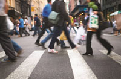

## Demographics

### Population

New York population distribution map
The distribution of change in population growth is uneven in New York State; the New York City metropolitan area is growing considerably, along with Saratoga County, while most of Western New York is nearly stagnant. According to immigration statistics, the state is a leading recipient of migrants from around the globe.

	
	
People Walking

Between 2000 and 2005, immigration failed to surpass emigration, a trend that has been reversing since 2006. New York State lost two house seats in the 2011 congressional reapportionment, secondary to relatively slow growth when compared to the rest of the United States. In 2000 and 2005, more people moved from New York to Florida than from any one state to another. However, New York State has the second largest international immigrant population in the country among the American states, at 4.2 million as of 2008; most reside in and around New York City, due to its size, high profile, vibrant economy, and cosmopolitan culture.

The United States Census Bureau estimates that the population of New York was 19,651,127 on July 1, 2013, a 1.4% increase since the 2010 United States Census. In spite of the open land in the state, New York's population is very urban, with 92% of residents living in an urban area, predominantly in the New York City metropolitan area.

### New York Racial Breakdown of Population

Racial composition                         | 1950  | 1970  | 1990  | 2000  | 2010  
-------------------------------------------|-------|-------|-------|-------|-------
White                                      | 93.5% | 86.8% | 74.4% | 67.9% | 65.8%
Black                                      | 6.2%  | 11.9% | 15.9% | 15.9% | 15.9%
Asian                                      | 0.2%  | 0.7%  | 3.9%  | 5.5%  | 7.3%  
Native                                     | 0.1%  | 0.2%  | 0.3%  | 0.4%  | 0.6%  
Native Hawaiian and other Pacific Islander | –     | –     | –     | 0.1%  | 0.1%  
Other race                                 | –     | 0.4%  | 5.5%  | 7.1%  | 7.4%  
Two or more races                          | –     | –     | –     | 3.1%  | 3.0%  

The state's most populous racial group, non-Hispanic white, has declined from 94.6% in 1940 to 58.3% in 2010. As of 2011, 55.6% of New York's population younger than age 1 were minorities. New York's robustly increasing Jewish population, the largest outside of Israel, was the highest among states both by absolute number and by percentage in 2012, driven by the rapidly growing Orthodox Jewish population, particularly in Brooklyn and the Hudson Valley.
