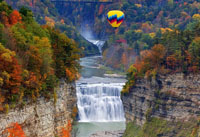

## Geography

	
	
Adirondack

New York covers 54,556 square miles (141,300 km2) and ranks as the 27th largest state by size. The Great Appalachian Valley dominates eastern New York and contains the Lake Champlain Valley as its northern half and the Hudson Valley as its southern half within the state. The rugged Adirondack Mountains, with vast tracts of wilderness, lie west of the Lake Champlain Valley. The Hudson River begins near Lake Tear of the Clouds and flows south through the eastern part of the state without draining Lakes George or Champlain. Lake George empties at its north end into Lake Champlain, whose northern end extends into Canada, where it drains into the Richelieu River and then ultimately the Saint Lawrence River. Four of New York City's five boroughs are situated on three islands at the mouth of the Hudson River: Manhattan Island; Staten Island; and Long Island, which contains Brooklyn and Queens on its western end.

### State parks

	
	
State Parks

Two major parks in the state are the Adirondack Park and Catskill Park.
New York has many state parks and two major forest preserves. Adirondack Park, roughly the size of the state of Vermont and the largest state park in the United States, was established in 1892 and given state constitutional protection to remain "forever wild" in 1894. The park is larger than Yellowstone, Everglades, Glacier, and Grand Canyon national parks combined. The thinking that led to the creation of the Park first appeared in George Perkins Marsh's Man and Nature, published in 1864.

### National Parks

* African Burial Ground National Monument in Lower Manhattan (New York City) is the only National Monument dedicated to Americans of African ancestry. It preserves a site containing the remains of more than 400 Africans buried during the late 17th and 18th centuries in a portion of what was the largest colonial-era cemetery for people of African descent both free and enslaved. The site's excavation and study was called "the most important historic urban archeological project in the United States.
* Fire Island National Seashore is a United States National Seashore that protects a 26-mile (42 km) section of Fire Island, an approximately 30-mile (48 km) long barrier island separated from Long Island by the Great South Bay. The island is part of New York State's Suffolk County.
* Gateway National Recreation Area is over 26,000 acres (10,522 ha) of water, marshes, and shoreline at the entrance to New York Harbor, the majority of which lies within New York. It covers more area than two Manhattan Islands.
* General Grant National Memorial is the final resting place of President Ulysses S. Grant, and is the largest mausoleum in North America.
