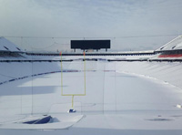

## Sports
New York hosted the 1932 and 1980 Winter Olympics at Lake Placid. The 1980 Games are known for the USA–USSR hockey game dubbed the "Miracle on Ice" in which a group of American college students and amateurs defeated the heavily favored Soviet national ice hockey team 4–3 and went on to win the gold medal against Finland. Along with St. Moritz, Switzerland and Innsbruck, Austria, Lake Placid is one of the three cities to have hosted the Winter Olympic Games twice. New York City bid to host the 2012 Summer Olympics but lost to London.

	
	
Caption

New York is the home of one National Football League team, the Buffalo Bills (based in the suburb of Orchard Park). Although the New York Giants and New York Jets represent the New York metropolitan area and were previously located in New York City, they play in MetLife Stadium, located in East Rutherford, New Jersey. The Meadowlands stadium hosted Super Bowl XLVIII in 2014, in which New York and New Jersey will share hosting duties. There was much controversy over several proposals for a new New York Jets football stadium. The owners of the New York Jets were willing to split the $1.5 billion cost of building a new football stadium over Manhattan's West Side rail yards, but the proposal never came to fruition.

	
	
Too much snow!

New York also has two Major League Baseball teams, the New York Yankees (based in the Bronx) and the New York Mets (based in Queens). New York is home to three National Hockey League franchises: the New York Rangers in Manhattan, the New York Islanders on Long Island and the Buffalo Sabres in Buffalo. New York has two National Basketball Association teams, the New York Knicks in Manhattan, and the Brooklyn Nets in Brooklyn. There are a variety of minor league teams that can be found throughout the State of New York, such as the Long Island Ducks. New York will be the home of a Major League Soccer franchise, New York City FC, starting in 2015. Although the New York Red Bulls represent the New York metropolitan area, they play in Red Bull Arena in Harrison, New Jersey.

### New York State major league professional sports teams

Club               | Sport      | League
-------------------|------------|--------------------------------
Buffalo Bills      | Football   | National Football League
Brooklyn Nets      | Basketball | National Basketball Association
New York Knicks    | Basketball | National Basketball Association
New York City FC   | Soccer     | Major League Soccer
Buffalo Sabres     | Ice hockey | National Hockey League
New York Islanders | Ice Hockey | National Hockey League
New York Rangers   | Ice Hockey | National Hockey League
New York Mets      | Baseball   | Major League Baseball
New York Yankees   | Baseball   | Major League Baseball
