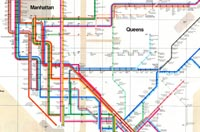
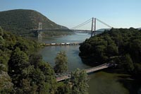

## Transportation

New York has one of the most extensive and one of the oldest transportation infrastructures in the country. Engineering difficulties because of the terrain of the state and the unique issues of the city brought on by urban crowding have had to be overcome perennially.

	
	
NYC Subway Map

Population expansion of the state generally followed the path of the early waterways, first the Hudson River and then the Erie Canal. Today, railroad lines and the New York State Thruway follow the same general route. The New York State Department of Transportation is often criticized for how they maintain the roads of the state in certain areas and for the fact that the tolls collected along the roadway have long passed their original purpose. Until 2006, tolls were collected on the Thruway within The City of Buffalo. They were dropped late in 2006 during the campaign for Governor (both candidates called for their removal).

	
	
Bear Mtn. Bridge

The New York State Department of Motor Vehicles (NYSDMV or DMV) is the governmental agency responsible for registering and inspecting automobiles and other motor vehicles as well as licensing drivers in the State of New York. As of 2008, the NYSDMV has 11,284,546 drivers licenses on file and 10,697,644 vehicle registrations in force. All gasoline powered vehicles registered in New York State must get an emissions inspection every 12 months. Diesel powered vehicles with a Gross Weight Rating over 8 500 lb that are registered in the NY Metropolitan Area must get an annual emissions inspection. All vehicles registered in NYS must get an annual safety inspection.

Portions of the transportation system are intermodal, allowing travelers to easily switch from one mode of transportation to another. One of the most notable examples is AirTrain JFK which allows rail passengers to travel directly to terminals at John F. Kennedy International Airport.
